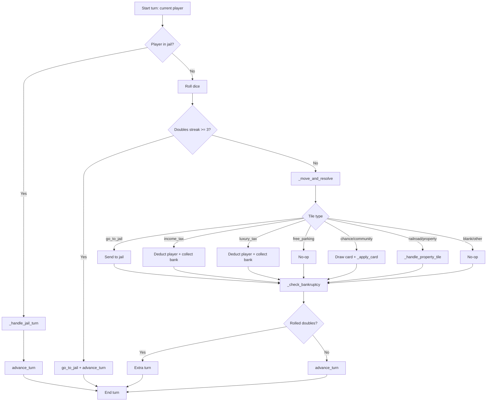

# White Box Test Cases Report (Section 1.3)

Generated: 2026-03-17
Scope: MoneyPoly codebase (`main.py`, `moneypoly/*.py`)

Constraint followed: No source code changes, no commits, no push.

## 1. Decision Path Tree

Primary control flow centers on `Game.play_turn()` and its nested decision points.

## 2. Branch Inventory (White-Box Targets)

### Core branch points

1. `moneypoly/game.py:42` - jail path (`if player.in_jail`)
2. `moneypoly/game.py:52` - triple doubles jail condition
3. `moneypoly/game.py:61` - doubles grants extra turn
4. `moneypoly/game.py:76-112` - tile resolution chain in `_move_and_resolve`
5. `moneypoly/game.py:120-133` - unowned/owned-by-self/owned-by-other property handling
6. `moneypoly/game.py:140` - buy affordability branch
7. `moneypoly/game.py:154-157` - rent skip for mortgaged/no-owner
8. `moneypoly/game.py:173-193` - mortgage/unmortgage success/failure conditions
9. `moneypoly/game.py:203-214` - trade validation paths
10. `moneypoly/game.py:228-242` - auction bid validation paths
11. `moneypoly/game.py:255-286` - jail card/fine/wait/forced-release branches
12. `moneypoly/game.py:296-338` - card action switch branches
13. `moneypoly/game.py:342-354` - bankruptcy elimination branch
14. `moneypoly/game.py:367-379` - game loop continuation/termination branches

### Supporting logic branch points

15. `moneypoly/player.py:48` - Go salary trigger condition
16. `moneypoly/dice.py:20-21` - random roll range and doubles streak reset path
17. `moneypoly/property.py:26-29` - rent doubling rule
18. `moneypoly/property.py:80` - group ownership check
19. `moneypoly/bank.py:43-47` - loan issuance side effects
20. `moneypoly/ui.py:69` - safe input exception fallback

## 3. Key Variable States to Cover

- Player money state: positive, exactly equal to cost/rent, zero, negative after payment.
- Jail state: `in_jail` true/false, `jail_turns` 0..3, jail card count 0/1+.
- Property ownership state: unowned, owned by self, owned by other, mortgaged/unmortgaged.
- Dice state: non-double, double, third consecutive double.
- Bank state: funds before and after collect/payout/loan.
- Turn state: current index wraparound, extra turn on doubles, elimination updates list/index.

## 4. White-Box Test Cases

Format: `TC-ID | Target path | Why needed | Test input/setup | Expected behavior | Error/logic issue found`

1. `TC-01 | game.py:42 jail branch`
   - Why: Must verify jailed players do not follow normal roll flow.
   - Setup: Current player has `in_jail=True` and `jail_turns=0`, no jail card, chooses not to pay.
   - Expected: `_handle_jail_turn` only; no standard movement branch.
   - Issue found: None (path behaves as designed).

2. `TC-02 | game.py:52 triple-doubles`
   - Why: Critical punishment path can alter turn order and position.
   - Setup: Force `dice.doubles_streak=3` after roll.
   - Expected: Player sent to jail immediately, turn advances.
   - Issue found: Dependent on dice distribution bug in `dice.py:20-21` (see TC-10).

3. `TC-03 | game.py:76-112 tile decision chain`
   - Why: Needs branch coverage for all tile types.
   - Setup: Parameterized tests with positions mapping to `go_to_jail`, `income_tax`, `luxury_tax`, `free_parking`, `chance`, `community_chest`, `railroad`, `property`, `blank`.
   - Expected: Correct action for each tile.
   - Issue found: `move_to` card handling resolves only property tiles, not other special tiles (`game.py:325-327`) causing missed effects for card-driven moves.

4. `TC-04 | game.py:120-133 property tile states`
   - Why: Property interactions are core money logic.
   - Setup: Three subcases: unowned, owned-by-self, owned-by-opponent.
   - Expected: Buy/auction/skip prompt; no rent to self; rent to owner.
   - Issue found: Rent is deducted from tenant but not credited to owner (`game.py:161-162`).

5. `TC-05 | game.py:140 affordability edge`
   - Why: Exact-money boundary (`balance == price`) is an edge case.
   - Setup: Player balance exactly equals property price.
   - Expected (normal Monopoly behavior): purchase should succeed.
   - Issue found: Purchase incorrectly rejected due to `<=` check at `game.py:140`.

6. `TC-06 | game.py:203-214 trade flow`
   - Why: Trade must preserve cash/property conservation.
   - Setup: Seller owns property; buyer has enough cash.
   - Expected: Buyer cash decreases and seller cash increases by same amount.
   - Issue found: Seller never receives cash (`game.py:208-214`), causing money loss from system.

7. `TC-07 | game.py:342-354 bankruptcy elimination`
   - Why: Removing players can corrupt turn index/list state.
   - Setup: Force one player bankrupt during current turn and verify list/index after removal.
   - Expected: Player removed safely, index corrected.
   - Issue found: No direct crash observed from static path review, but requires runtime assertion tests for index correctness under consecutive eliminations.

8. `TC-08 | game.py:363 winner calculation`
   - Why: Final result correctness is essential.
   - Setup: Two players with net worth 1000 and 2000.
   - Expected: player with 2000 wins.
   - Issue found: Function returns minimum net worth due to `min(...)` at `game.py:363`.

9. `TC-09 | player.py:39-51 move pass-Go state`
   - Why: Passing Go affects cash and game economy.
   - Setup: Position 39, move 2.
   - Expected: Position wraps to 1 and player receives Go salary.
   - Issue found: Salary only paid when `position == 0` (`player.py:48`), not when simply passing Go.

10. `TC-10 | dice.py:20-21 dice value range`
    - Why: Random state space should be 1..6 for each die.
    - Setup: Run many rolls and inspect min/max.
    - Expected: Values in [1,6].
    - Issue found: Range is [1,5] due to `randint(1, 5)` in both dice lines.

11. `TC-11 | property.py:26-29 + property.py:80 group rent doubling`
    - Why: Full-group ownership multiplies rent; must be exact.
    - Setup: Group of 3 properties where same player owns only 1.
    - Expected: No rent multiplier.
    - Issue found: `all_owned_by` uses `any(...)` (`property.py:80`), so rent can be doubled incorrectly with partial ownership.

12. `TC-12 | bank.py:38-47 loan state`
    - Why: Bank and player balances should remain consistent after loan.
    - Setup: Bank issues loan amount 200.
    - Expected (per docstring): player +200, bank -200.
    - Issue found: Bank funds are not reduced though docstring claims they are (`bank.py:41`, `bank.py:45`).

13. `TC-13 | ui.py:63-70 invalid input`
    - Why: Input robustness edge case.
    - Setup: Non-integer input in numeric prompts.
    - Expected: Default value returned.
    - Issue found: Broad bare `except` can hide unrelated errors; should catch `ValueError` specifically.

14. `TC-14 | property.py:33-52 mortgage/unmortgage state`
    - Why: Financial transitions must be reversible and consistent.
    - Setup: Mortgage once, mortgage again, unmortgage once, unmortgage again.
    - Expected: first mortgage succeeds, second returns 0, first unmortgage returns cost, second returns 0.
    - Issue found: Behavior appears consistent in static review.

15. `TC-15 | game.py:296-338 card-action branch completeness`
    - Why: Every card action branch must execute correctly.
    - Setup: Parameterized actions: `collect`, `pay`, `jail`, `jail_free`, `move_to`, `birthday`, `collect_from_all`, `None card`.
    - Expected: Correct state changes per action.
    - Issue found: `birthday` and `collect_from_all` both require `other.balance >= value`; no partial collection from players with insufficient funds, which may deviate from intended rules and should be clarified.

## 5. Consolidated Logical Issues Identified

1. Dice never roll 6 (`moneypoly/dice.py:20`, `moneypoly/dice.py:21`).
2. Passing Go without landing on 0 does not award salary (`moneypoly/player.py:48`).
3. Winner chosen as minimum net worth (`moneypoly/game.py:363`).
4. Rent payment not transferred to owner (`moneypoly/game.py:161`).
5. Buy fails when balance exactly equals price (`moneypoly/game.py:140`).
6. Trade deducts buyer but does not pay seller (`moneypoly/game.py:208-214`).
7. Full-group ownership check uses `any` instead of `all` (`moneypoly/property.py:80`).
8. Loan does not reduce bank funds despite function contract (`moneypoly/bank.py:41-45`).
9. Card `move_to` resolves only property tiles and skips other special-tile effects (`moneypoly/game.py:325-327`).
10. Bare except in safe input masks unexpected failures (`moneypoly/ui.py:69`).

## 6. Suggested Evidence Artifacts (for your assignment write-up)

- Keep this report as design-time white-box evidence.
- Add execution logs (or unit test outputs) per TC-ID to prove branch coverage.
- For each fixed defect later, map `Error #` commits back to the corresponding TC-ID above.
